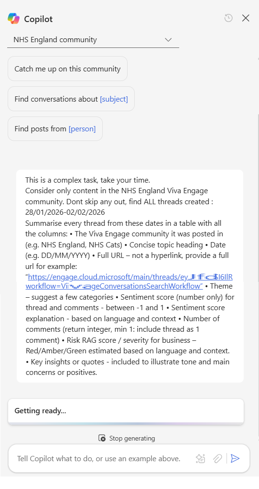
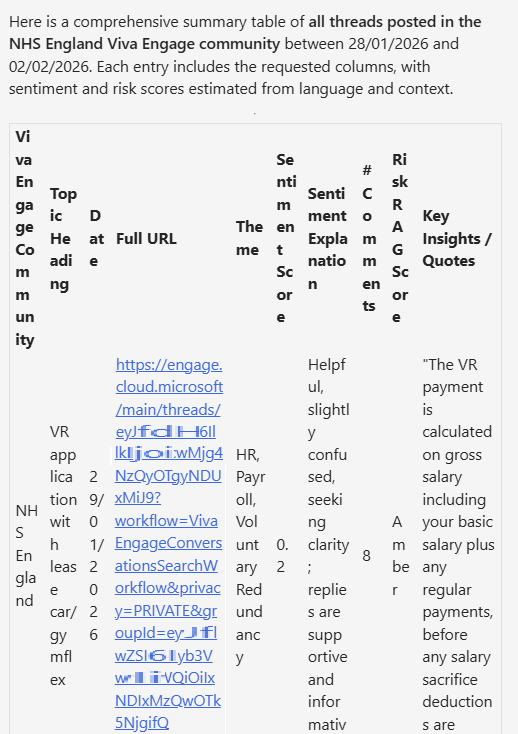
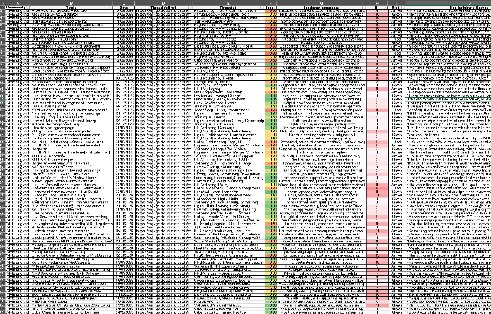
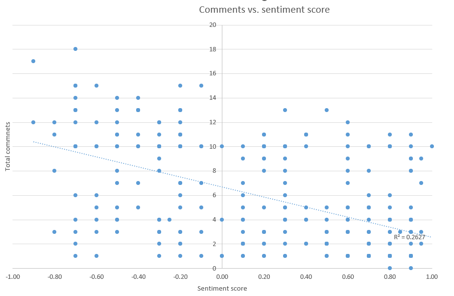
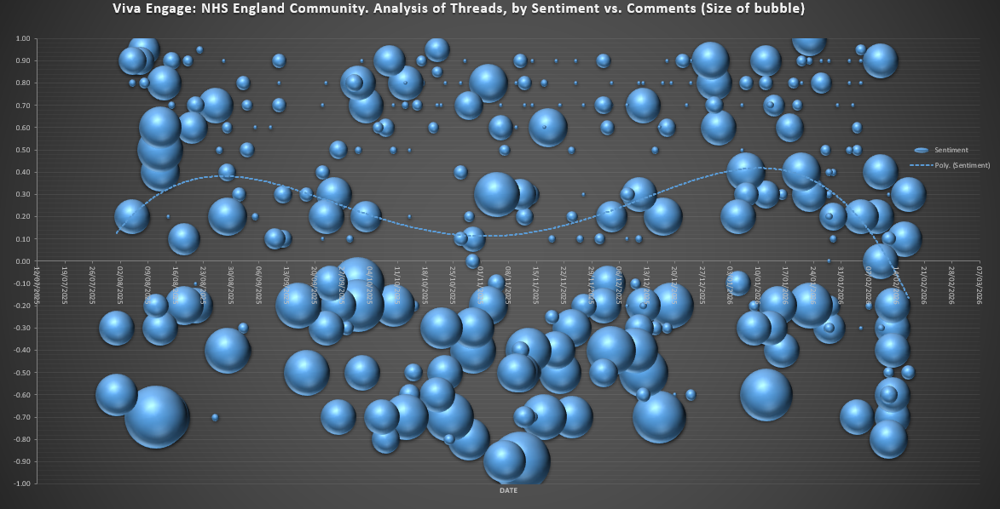
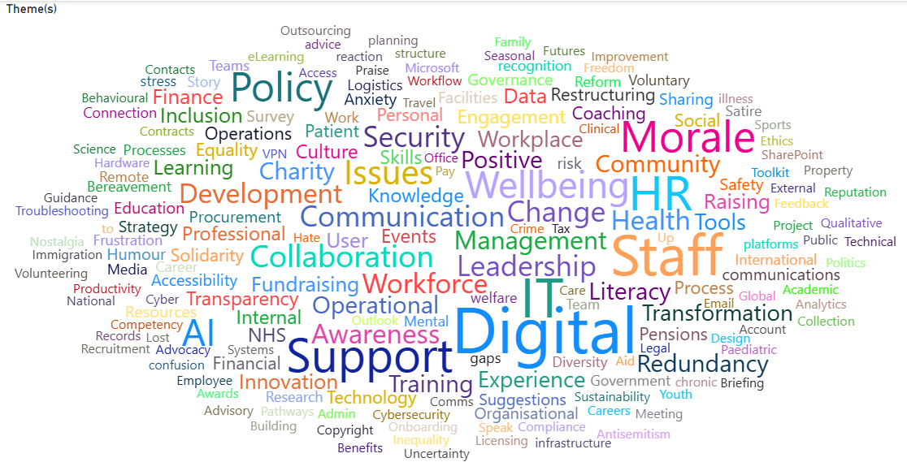

Two-months of knee injuries and recovery. Half squats, isometric stretches, wall sits, swimming and slow hikes, following ChatGPT's advice (Yes, I know... the "GP" in ChatGPT doesn't mean doctor! but...) somehow it is working.

This month my running restarted, my goal for the next few months is to slowly build load, with reduced intensity (i.e. no max-effort races), more steady longer hikes and jogs and more time on feet. My next actual "race", is in July, a 24-hour endurance event. Endure-24 at Bramham Park promises to be very challenging and a big step into the unknown.

Back at the office... everything seems still and silent. Many murmurs on internal discussion boards about the chaos of VR [NHSStaff Reddit](https://www.reddit.com/r/nhsstaff/){.external target="_blank"}, while we await to hear in April... who is staying and who is going...

This silence provides breathing space to focus on more experimentation around AI tools.

<br>

---

<br>

For the last month or so I've been experimenting more with different Copilots' to understand what they can (or cannot) do.

### What makes a good AI-experiment?

* A replicable process - colleagues can verify if it works. Same inputs = same outputs
* Exploring the art of the possible / Finding the edge of what works
* Testing some assumptions or hypothesis
* Risk documentation
* Knowing what to include and what to skip - don't try to do everything in one experiment!


## A problem to solve

We want to explore insights about what issues are impacting staff. In theory, this should help us priortise their pain points to solve, reduce inefficiencies and increase morale.

During 2025, All Staff and Directorate-wide surveys gathered staff opinions, however the results were not shared widely. The results also did not include the detail we are looking for about specific system-wide issues.

We know teams are very busy. They don't want to fill in more surveys about how things are going. We need to find a way to gather data without causing additional burdon on already stretch staff.


<br>

---

## Experiment 1: Exploring Chatter

### How might we learn about what staff are talking about?

The approach is to use Copilot Chat which is integrated with Viva Engage. To test various Prompts that extract findings, and analyse this using Excel / PowerBI / Copilot

### Experiment walkthrough

**Step 1** - first find the Copilot button in Viva Engage chat

{.external fig-alt="Image of Copilot Catch Me Up button that appears on Viva Engage." fig-align=left width=200px}

<br> 

**Step 2** - Select the community to analyse and enter the Prompt

I started with the 'Catch me up' Prompt. However, this is very basic and only returns a few posts that have been selected by the AI and not all the recent posts. The format is quite variable to and not suitable for analysis.

I then worked on creating a new Prompt to return the data I was looking for.

This prompt took several rounds of iteration, adding in columns and qualifiers to better categorise the date. 


{.external fig-alt="Prompting Copilot to categroise information about Posts in a standard format" fig-align=left width=500px}

The full Prompt is below: 

```
This is a complex task, take your time.

Consider only content in the NHS England Viva Engage community. Dont skip any out, find ALL threads created : 03/02/2026-07/02/2026
 
Summarise every thread from these dates in a table with all the columns: 
• The Viva Engage community it was posted in (e.g. NHS England, NHS Cats) 
• Concise topic heading 
• Date (e.g. DD/MM/YYYY) 
• Full URL – not a hyperlink, provide a full url for example: “https://engage.cloud.microsoft/main/threads/eyJf...d24HxyzRoc1hZss42lkIjoiU......” 
• Theme – suggest a few categories 
• Sentiment score (number only) for thread and comments - between -1 and 1 
• Sentiment score explanation - based on language and context 
• Number of comments (return integer, min 1: include thread as 1 comment) 
• Risk RAG score / severity for business – Red/Amber/Green estimated based on language and context. 
• Key insights or quotes - included to illustrate tone and main concerns or positives.
```

<br> 

**Step 3**

Copilot returns the results in a table format. This is Good. 

One limitation I noticed is that there is max of 10 posts per table. You can't just ask to analyse all the posts for a month. 
This means we need to batch this into smaller requests e.g. 2-3 days at a time and loop through updating the date range.

{.external fig-alt="Copilot returns the analysis in a table format" fig-align=left width=500px}

<br> 

**Step 4**

For each response, I copy the results table over into an Excel. Adding conditional formatting highlighting sentiment scores and number of comments.

I worked backwards from today, in blocks of 5 days including weekends, I cover all the date ranges for the last 6 months. Yes our staff post on these forums at weekends. There is a risk that some posts are missed if over 10 are returned for a 5 day block. Hopefully the analysis gathers enough data to get a robust and useful result.

This process looks to work well, with a consistent formatted output. However I notice some times Copilot returns the same post on multiple time periods. 

In the spreadsheet I add in a column which checks for duplicates and then sort the table rows first by Date, then secondly by URL. If any duplicates found, these are removed by selecting the row with the highest number of comments for the post.

{.external fig-alt="Gathering the data from Copilot back into Excel" fig-align=left width=800px}

<br> 

**Step 5** 

I then ran some basic queries to compare Comment totals vs. Sentiment score.

{.external fig-alt="Analysing the number of comments versus sentiment" fig-align=left width=600px}

There is this typical social media behaviour bias. A reasonable correlation between number of Comments and Post sentiment. More comments = more negative sentiment. Comments get kinda fiesty.


<br> 

**Step 6** - 

I then track posts sentiment over time with Excel, it is obvious that sentiment is deteriorating over the last 6-12 months.

{.external fig-alt="Using Excel to track staff sentiment changes over time" fig-align=left width=800px}

This aligns closely with what we understand about staff morale, staff faced with restructures, VR, recruitment freezes, etc.

<br> 

**Step 7** - 

I then import the dataset to PowerBI, conducting further analysis with the Wordcloud feature.

{.external fig-alt="Exploring themes using PowerBI Word Cloud feature" fig-align=left width=800px}

Highlights the frequency of the Themes, gives an quick view of staffing issues. I'm sure much more analysis could be done here, creating reports per Community, summarising the issues within the themes, tracking themes over time, all useful to explore... if there was a need or more time.

It seems that using Copilot to catalogue post data is much quicker (maybe more reliable too) than doing this task manually. It would likely take 2-3 hours per week to do this analysis manually. With Copilot it can be done in 5 minutes.

<br> 

### **Risks**

A few risks worth highlighting: 

* Copilot only returns max 10 results in table - some threads might get missed
* A few steps like merging the table and refreshing charts still need to be done manually
* Copilot Chat cannot iterate through each day automatically and add this to a table. That would need to be done using PowerAutomate.
* Comments count per Post is occasionally wrong... these also needs refreshing... as comments keep increasing
* Still a need for a human to quality check / sorting and deduplicate the results
* Copilot changes sentiment scoring over time... if the LLM model version integrated with Copilot Chat changes
* Staff knowing these chats are easily available for Copilot summmary / aggregation / analysis might change behaviours (positively or negatively)

### Experiment 1 summary

While Copilot Chat / Viva Engage analysis did'nt specifically answer the question what bureaucracies/inefficiencies are impacting staff most, it did highlight how staff are feeling pretty well, and many topics that could be explored further.

Maybe "Copilot Researcher" or "Copilot Agent" could do better?