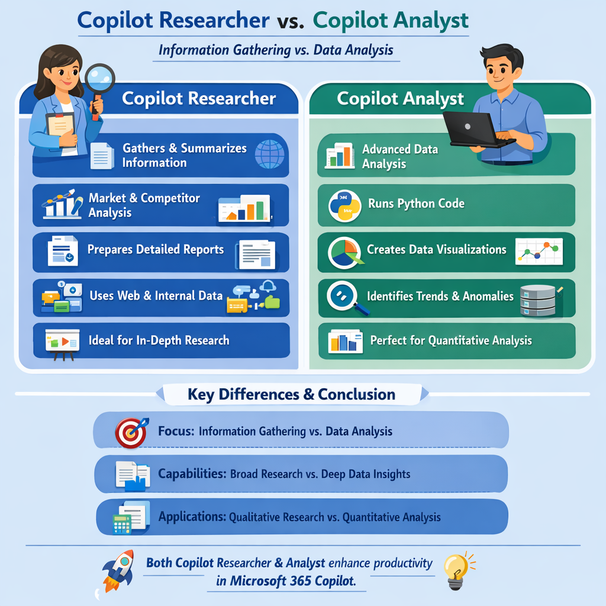
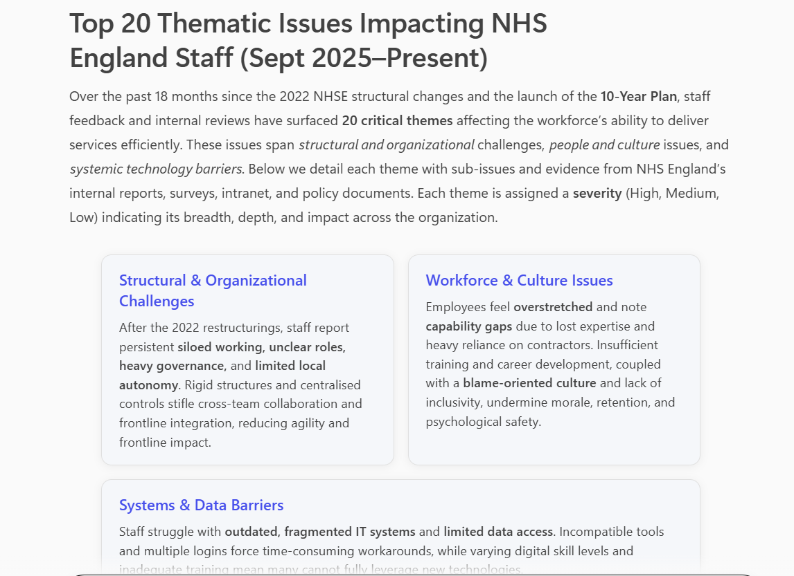
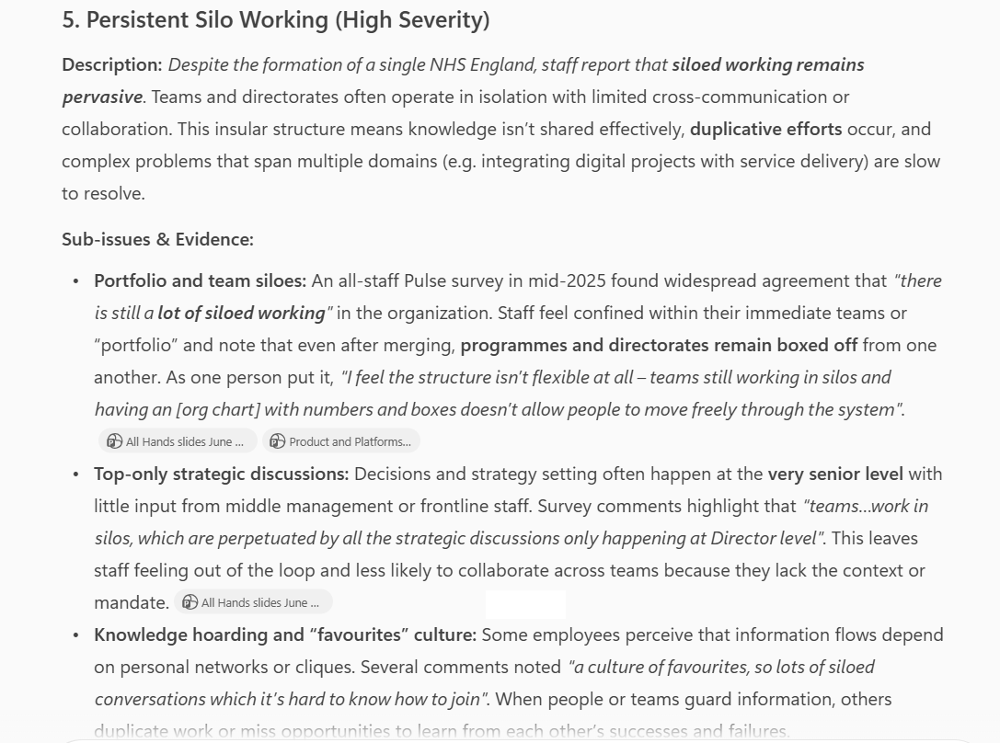
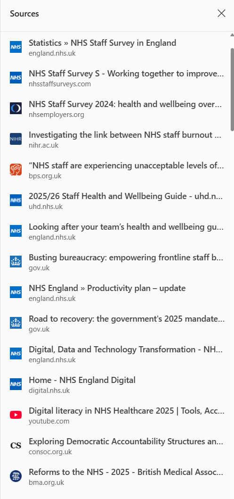
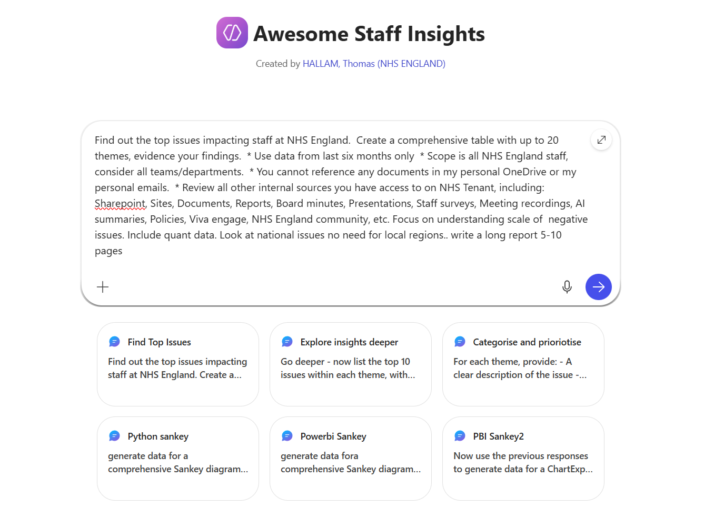

This continues from the [previous post](../2026-03-01/copilot-chat-discovery.html), part of a series of mini-experiments around using Copilot to explore staff struggles at NHS England.

**TL;DR**

I'll say up front, the experiment took much longer to complete than hoped... it was frustrating to write up too. I started in March, yet here we are two months later.

I tried lots of different approaches to solving the same problem: what are the issues impacting staff? can ai categorise the issues and help us understand root causes?   which of these issues can we help with?

I guess I hoped for a better outcome of the experiment - a simple repeatable workflow rather a few bits of the puzzle. However, I conclude that maybe I'd asked too much of Copilot? Or maybe the different Copilots are only good at some parts of these tasks? Or maybe I was just hallucinating down a rabbit hole... following the AI-koolaid. 

Either way, there were some useful findings, and I'm sure as I learn more about deploying AI solutions, there will be a way to create a reliable workflow for these use-cases.

<br>


## Which Copilot?

There are many Copilots. Copilot Chat, Copilot M365, Copilot Researcher, Copilot Analyst, Copilot Agents, Copilot Studio, Copilot Github, [and many more...](https://teybannerman.com/strategy/2026/03/31/how-many-microsoft-copilot-are-there.html){.external target="_blank"}

Copilot itself generated a useful infographic explaining the differences between Copilot Agents. 

{.external fig-alt="Infographic showing a comparison of Copilot agents and their benefits" fig-align=left width=700px}

My assumption is that i'll need to try both Copilot Researcher and Copilot Analyst to see if they can find and categorise relevant insights or documents... hopefully both can find mode relevant insights that in [Experiment 1](../2026-03-01/copilot-chat-discovery.html)


## Exploring Researcher Mode

I start by opening Copilot M365, heading to "Copilot Researcher". Ask the prompt below. 


**Prompt 1**
``` 
What are the top 20 high-level thematic issues impacting **efficient delivery of IT** at NHS England? Take your time, this needs to be comprehensive.

Create a table with evidence of your findings:
Spec:
- Consider information from September 2025 onwards. 
- Consider all NHS England staff, include issues impacting both clinical and non-clinical NHSE staff
- Consider All internal shared documents you have access to (prioritise data from: Board reports, Staff Surveys, recently updated policies and intranet pages, staff community discussions)
- Categorise findings by themes (workforce, org structure, system issues, culture, management, red tape, etc)
- Evidence with summarised references (e.g. links to documents, include date, and key quotes)

Keep going till you are confident the 20 most significant thematic issues have been found. 

Go ahead.

```

<br>

Copilot's response seemed quite narrow, the issues about what efficient IT-delivery were poorly defined and confused with wider issues impacting all-staff. 

I decided as this didn't tell the whole story, so I zoomed out more and see what else Copilot Reearcher could find.

<br>

**Prompt 2**
```
What are the top 20 high-level thematic issues impacting **staff** at NHS England? Take your time, this needs to be comprehensive.

Create a table with evidence of your findings:
Spec:
- Consider information from September 2025 onwards. 
- Consider all NHS England staff
- Consider All internal shared documents you have access to (prioritise data from: Board reports, Staff Surveys, recently updated policies and intranet pages, staff community discussions)
- Categorise findings by themes (workforce, org structure, system issues, culture, management, red tape, etc)
- Evidence with summarised references (e.g. links to documents, include date, and key quotes)

Keep going till you are confident the 20 most significant thematic issues have been found. 

Go ahead.
```

<br>

After 15-20 minutes of reviewing information, Copilot returned an aggregated report.

{.external fig-alt="Copilot Researcher mode can analyse your internal staff data" fig-align=left width=800px}

<br>This was really interesting, and on initial review the outputs were quite comprehensive, well structured and referenced. 

It was reassuring to see broad and contentious issues like staff well-being, bullying, racism being surfaced as high level themes. 

<br>

Prompt 3
```
Considering the two previous requests, Review each of the themes you identified: 
- Give me a MORE detailed breakdown... 
- List up to 5 sub-issues within the theme, with evidence
- Provide an overall rank of the severity of each theme

Finally, summarise all you have learned into one big table with references.
```
<br>

I explored the detail of some of the issues, these seemed to resonate closely with what I had heard colleagues discussing, I knew these were common issues raised in previous staff surveys too. Encouraging.
 
<br>

{.external fig-alt="Exploring themes using PowerBI Word Cloud feature" fig-align=left width=800px}

Considering the results, I wasn't aware that I had access to some of the returned files, there are so many SharePoints and documents - how could any one person ever review them all? It did make me wonder what is going on in terms of prioritisation of files, or whether my query triggered a new search of the data behind the scenes, or was the data I searched for already indexed in a way Copilot could retrieve it? Again, its a bit of mystery with LLMs that we cannot know exactly how they work...


<br>


## Copilot Analyst Mode

I then opened up another tab with "Copilot Analyst". I post prompt 1 + 2 from above into the Analyst chat.

The sources that Copilot Analyst used were much more wide ranging, including internal and external documents. I'm not sure if that is a good thing yet, but I continue the experiment.

{.external fig-alt="Copilot Analyst sources are wide and interesting" fig-align=left width=300px}


I then wanted to see if I could expand the insights around sub-themes and root causes, this wasn't particularly successful with this prompt.

Prompt 4
```
For each issue, determine its associated sub-theme, broader theme, and underlying root cause. 

Identify known pain points, assess severity, assign weight values to each link based on evidence — reflecting impact, frequency, and urgency. 
```

One thing I wanted to see was some prioritisation by strength of evidence. On this point I wasn't convinced that Copilot got all the weighting right, or provided sufficient evidence, but I carried on down a rabbit-hole to see where this would go.


<br>

**Exploring how IT digital systems are impacting staff**

I also went into a bit of a side-quest... rabbit hole.... looking into the IT digital systems, to understand if there was sufficient insights in either Researcher or Analyst to deduce how IT is holding back teams.


Prompt 5
```
For staff pain points related to IT digital systems, I need to know specifically which systems are in need of fixing that are impacting staff. 
For each IT system you are aware of, tell me what issues are impacting staff.
Break down the analysis by:
* staff efficiency/workflow, 
* clinical risk, 
* UX/usability, 
* staff satisfaction
* accessibility issues
* calculate number of staff impacted

Consider all departments and all systems used by NHSE staff. 

[Optional] Prioritise the response based on severity of issues in terms of inefficiency impact to the organisation.
```

This was very interesting, but slightly distracting from the main task. This also ended up muddying the data up for later tasks, as there were two concurrent chain-of-thought experiments within the same conversation flow. 

I had to start over. Lesson learned for next time.

<br>

## Copilot Agent builder

Finally, I then tried to create an Agent with the four tasks. Here is the prompt

Prompt 10
```
"Perform a deep retrieval across internal sources for the last twelve months, focusing on:

* Detailed staff survey results
* AI-generated meeting summaries
* Board papers and reports discussing workforce issues
* Viva Engage and NHS England community posts
* Policies and strategy updates related to staff experience

Split the queries into multiple sub-themes (e.g., wellbeing, workload, EDI, leadership engagement, digital tools) and run parallel searches across these sources. Once I have the results, I’ll extract and synthesize the most relevant passages to validate each theme.

Show your step-by-step workings, using 'Copilot Researcher' mode."
```

<br> 

However it seemed the Copilot Agent was not able to access the wide range of document sources my personal account had access to. 

The Agent was less comprehensive than Researcher and less competent at data tasks than Analyst. 

So while the Agent Builder interface was easy to use, and somewhere to save my prompts, it wasn't really fit for purpose either for data gathering or data analysis. I shelved the Copilot Agent idea fairly quickly.

{.external fig-alt="Interface for creating a new Agent" fig-align=left width=800px}

It seems that to create a suitable structured workflow... that would need to be built in PowerAutomate with CopilotStudio, or to manually run all the prompts on a regular cadence.

Filtering results by date is a really significant problem... if I need to bring data from past month/six-months/year, etc, Copilot must stop returning data from three years ago as it spoils all the results!!

<br>

**So what actually works?**

* Gathering staff pain points data from wide range of internal and/or external channels
* Creating basic charts in Copilot, using various formats

**What are the risks?**

* Gathering data that is either too narrowly defined or to wide
* Gathering data that from the wrong time periods
* Multiple stage workflow required is difficult to recreate
* Some workflows requires Python or PowerBI to create the diagram, need to know basics
* Sankey diagrams are complex and difficult to edit - maybe other tools could do this easier
* When producing outputs, need standard formats (e.g. remove all comments as they are not accepted in json files)
* Overconfidence in the quality of findings generated by AI
* Inability to validate how data sources are being prioritised
* Easy to bias results with pre-defined categories


Continues on [next post](../2026-05-28/mapping-route-causes-healthcare-IT-inefficiency.html)
