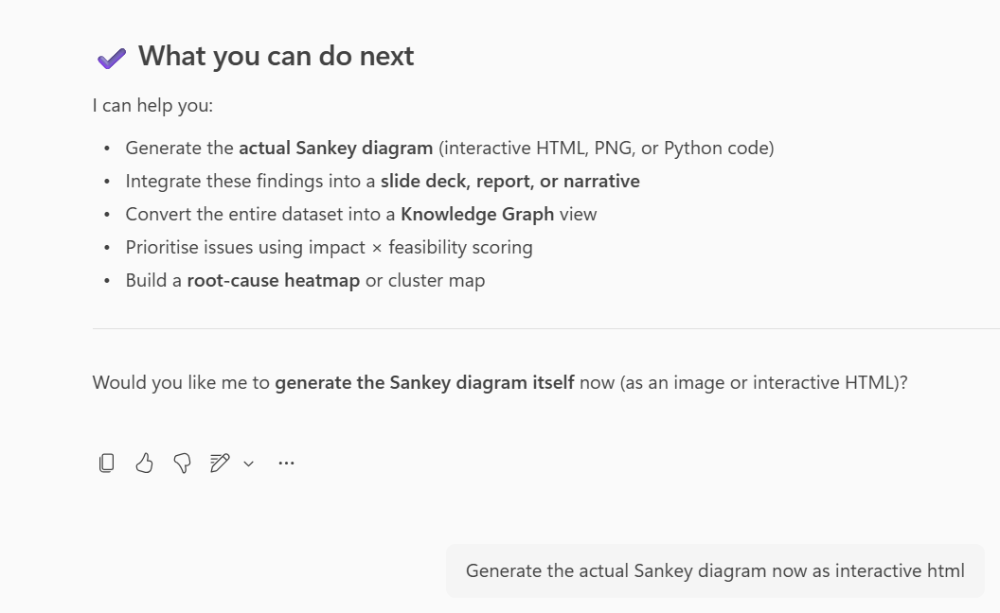
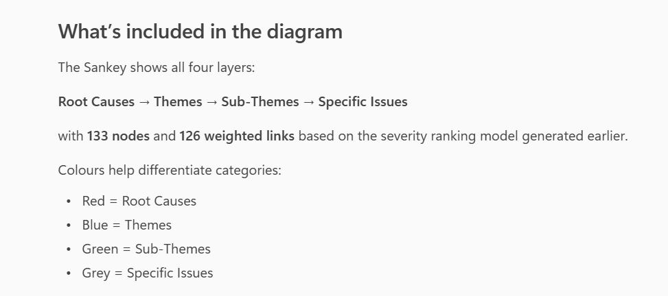
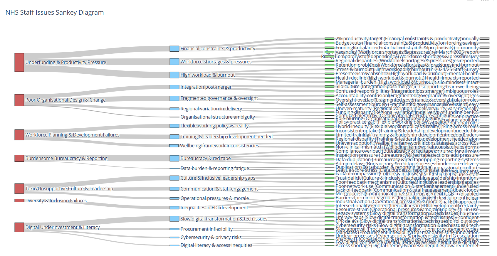
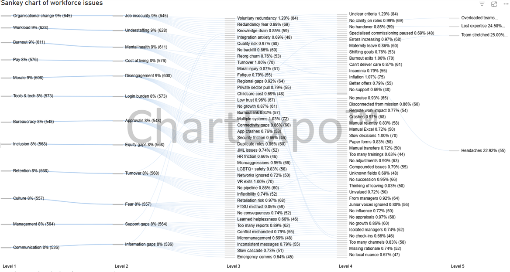
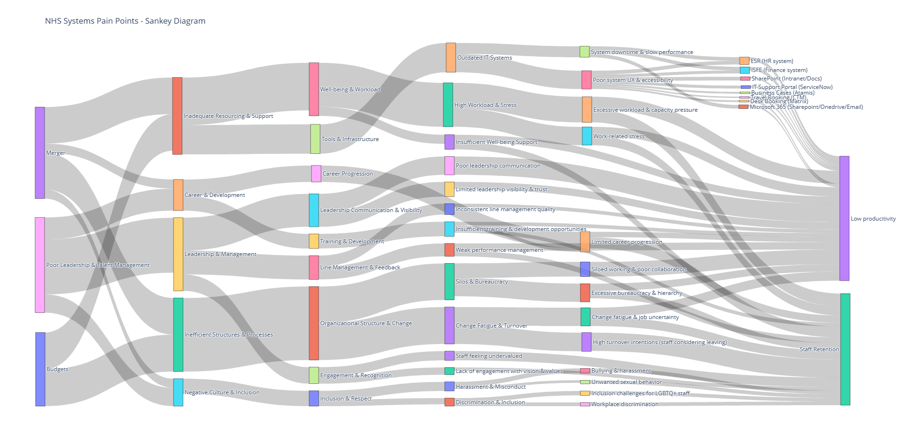

This continues from the [previous post](../2026-03-20/copilot-researcher-deep-dive.html), part of a series of mini-experiments around using Copilot to explore staff struggles at NHS England.


### Mapping root causes

I then wanted to take the information Copilot had aggregated about Issues, Sub-themes and Themes and visualise this. The broad goal here was to:

* Build a Sankey diagram illustrating connection between issues/root causes
* Using available tools, Copilot, Excel, Python or PowerBI
* To be able to track changes on a quarterly basis

There are many ways to do this, including: 

* asking Copilot to create an infographic
* asking Copilot Analyst to build a chart
* asking Copilot to write Python code
* asking Copilot to build a data table to deploy in Excel/PowerBI

I tried a few of these to see if I could map out the root causes in a way that was sensible, understandable and repeatable. 


**Copilot for Sankey diagrams**

One-shot scrappy attempt...

Prompt 6
```
ok - can you produce a sanky diagram which I can export to VSCCODE showing all the root causes on the left and how they link across themes to specific issues/concerns on the right. full code for Plotly including the weights based on severity
```

After several prompts back and forth, Copilot created a number of files including a .csv with data and instructions how to deploy this on my machine

I reviewed the output asked Copilot to re-write the prompt into a more re-usable template: 

<br>

Prompt 7
```
"Generate data for a comprehensive Sankey diagram with layers that maps NHS staff-facing issues across the following structure:  
Root Causes → Themes → Sub-Themes → Specific Issues 

The output should include:  
* A table listing all nodes and their categories (Root Cause, Theme, Sub-Theme, Specific Issue) 
* A spreadsheet-ready table of: source_label, target_label, and value
Go ahead"
```

{.external fig-alt="Using Copilot Analyst mode to generate a Sankey diagram" fig-align=left width=800px}

{.external fig-alt="Customising the Sankey diagram to show a number of nodes" fig-align=left width=800px}

Prompt 8
```
"Generate the actual Sankey diagram now as interactive html"
```

{.external fig-alt="Copilot Analyst Sankey diagram created with Python" fig-align=left width=800px}

Although difficult to read and navigate, it did actually work in the browser without any packages being installed. 

I then tried the same process, but asking for the data to be formatted for PowerBI ChartExpo. Copilot wrote me this prompt so the process could be repeatable.

Prompt 9
```
Copilot You are generating dummy data for a ChartExpo Sankey in Power BI. 
GOAL
Produce a CSV where each row describes one flow path across up to six levels.
Every row MUST have exactly 7 columns with this header:
Level 1,Level 2,Level 3,Level 4,Level 5,Level 6,Value
Rules:
- The CSV MUST include the header above on the first line.
- Use commas as separators, no trailing commas, and no extra columns.
- If a path does not use all six levels, leave the unused level fields BLANK (empty string), 
  but ALWAYS keep Value as the LAST column.
- Value MUST be a positive integer (whole number).
- Do NOT include summary/footer rows, comments, or explanation—CSV only.
```


The result is below.

{.external fig-alt="Converting the dataset into a format for PowerBI ChartExpo Sankey" fig-align=left width=800px}

<br> 

I also tried Copilot Researcher to create a Sankey that could be deployed locally in Python.

This was the most visually appealing version, using Plotly, however it was very difficult to modify the data if needed.

{.external fig-alt="Using the Copilot Researcher to generate an csv dataset to that Python can deploy locally" fig-align=left width=800px}

Again, using the same data, but a different chart output. This is making me wonder how reliable Copilot is for this type of task.

---

<br>

## And that's all folk. 

It's the end of these, multiple, Copilot experiments... I'd say the results were intriguing, but the outputs were not truly reliable enough to make decisions with. They didn't really reveal much beyond what we already know. 

There are many issues impacting NHS IT delivery and staff, many of these are due to the org restructure, budgets etc.

I hope you enjoyed reading this!! Would love to hear if anyone has tried to build a similar workflow for their org?!

