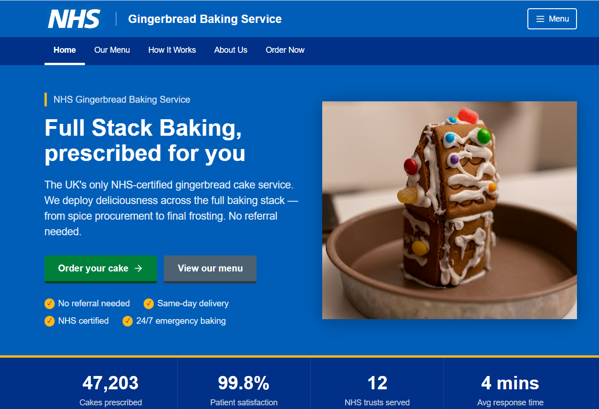
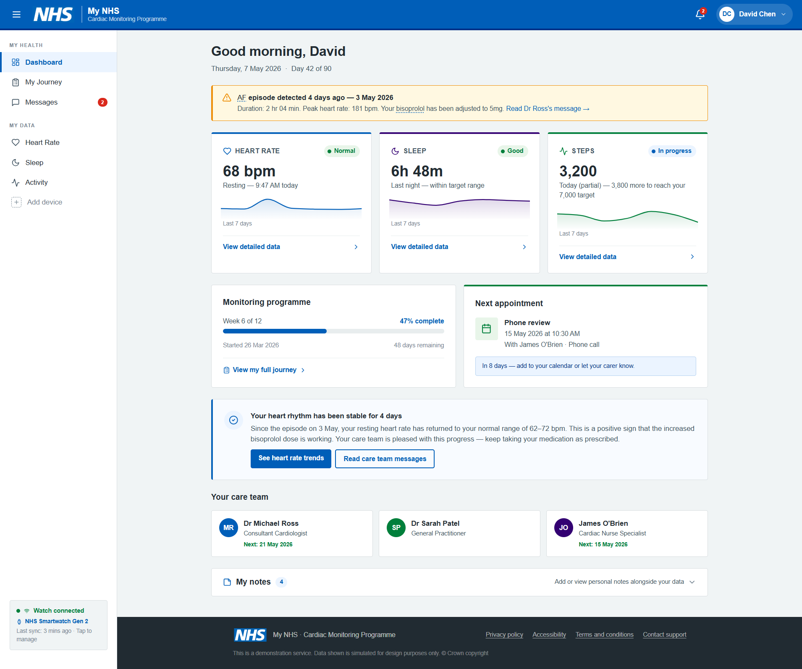
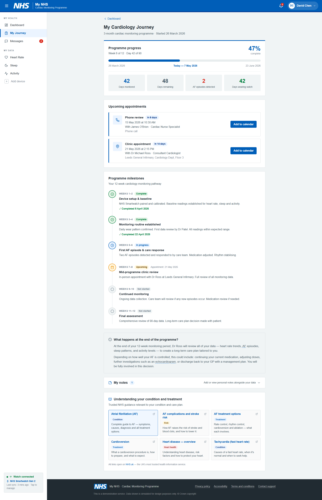
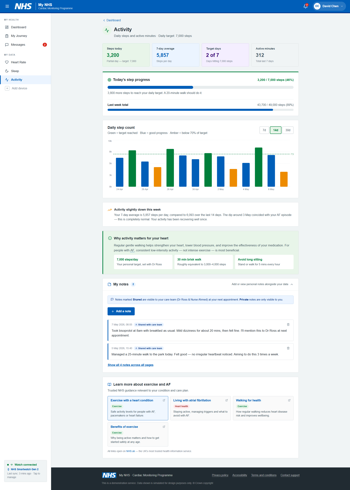
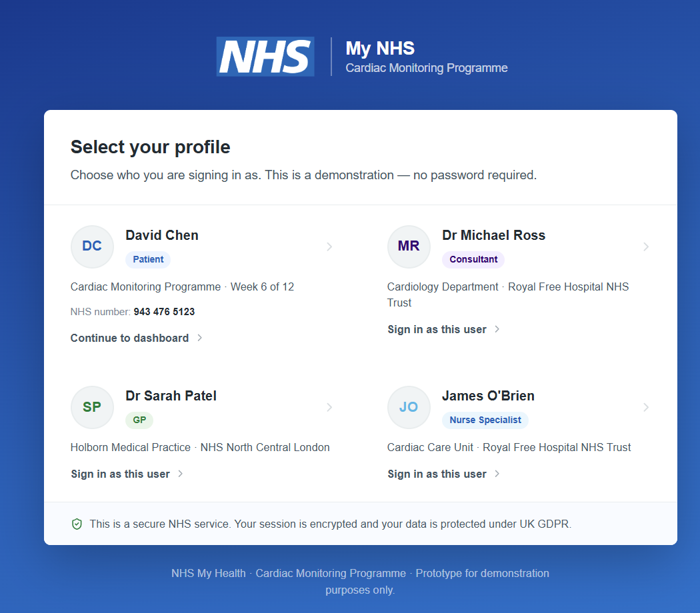
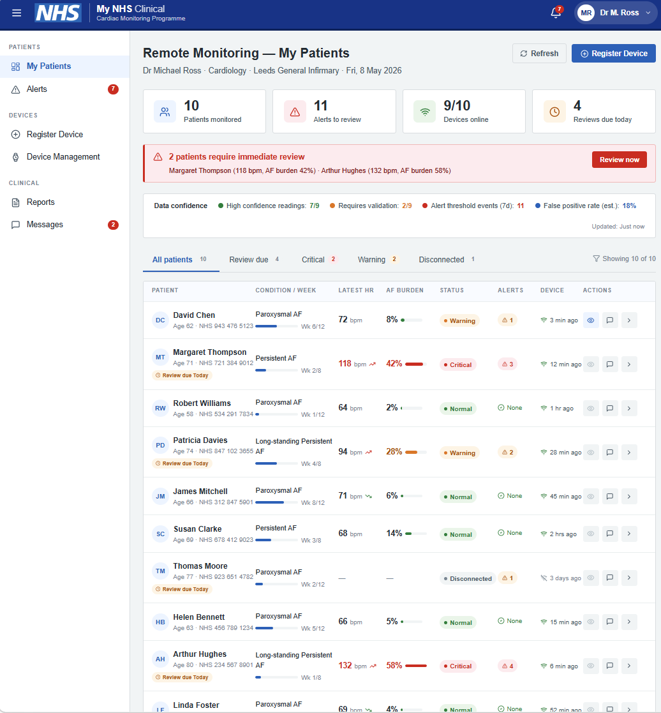
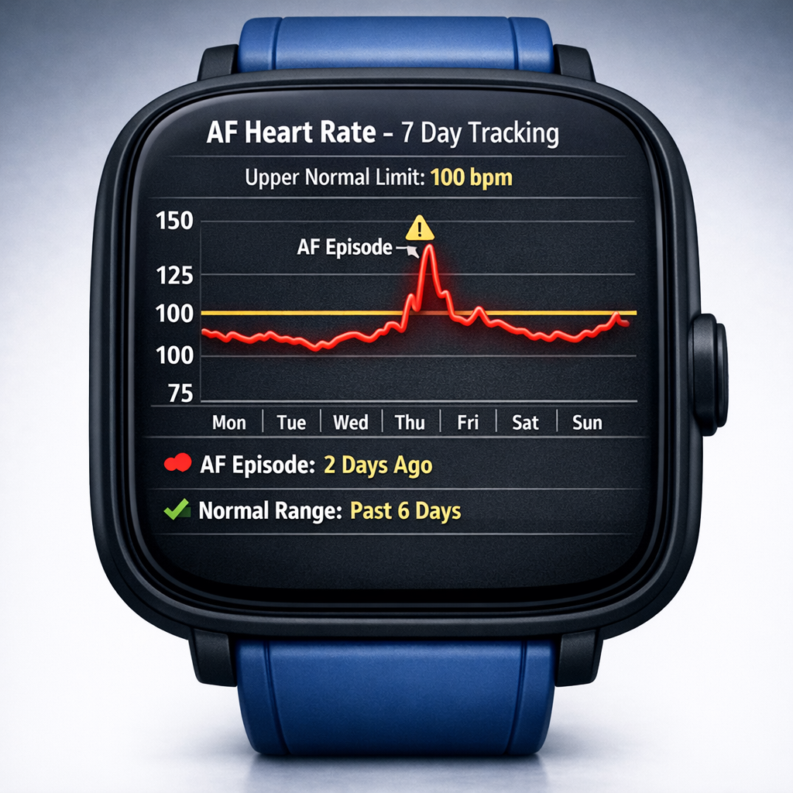
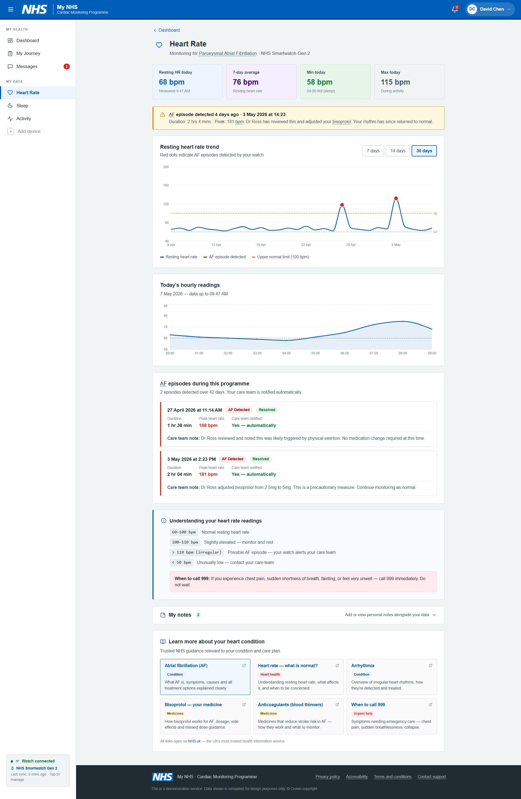
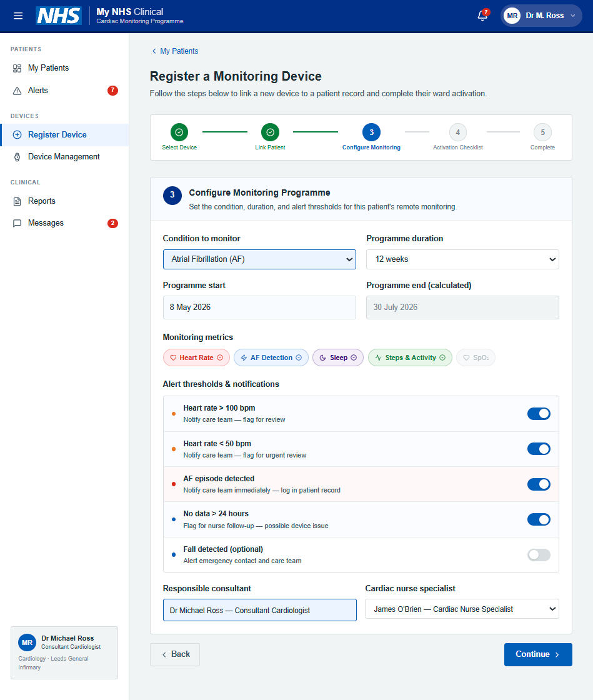

AI has changed the speed limit for design work.

That is exciting, but it also makes discipline more important. In this experiment I wanted to answer a simple question:

How does AI impact ideation in a service context where user safety, evidence, and delivery constraints all matter?

Rather than debating in theory, I ran a practical test: start with research synthesis, move into rapid prototype generation, add a device-specific design layer, then extract and run the prototype code locally before deploying it to the cloud.

The scenario was fictional but realistic: a cardiology patient journey where a smartwatch streams heart rate, sleep, and activity data into a "My NHS" style service.

 

## Why this experiment

Most teams I speak to are feeling the same tension:

1. We can generate concepts faster than ever.
2. We are less certain where quality gates now belong.
3. We are not yet aligned on what "good" looks like when AI can produce code and UI from prompts.

I wanted to test a full flow end-to-end, not just one prompt in one tool.

 

## The experiment flow

I followed a test-and-learn sequence that mirrors real delivery pressure:

1. Synthesise user needs from existing insight using Copilot Researcher and UR Finder.
2. Turn those needs into design requirements and hypotheses.
3. Use Figma Make to generate multiple throwaway prototypes of a fictional patient journey.
4. Use Copilot to create smartwatch interface concepts and specialised views.
5. Extract generated code and run locally.
6. Deploy to cloud to share and evaluate.
7. Reflect on what sped up, what broke down, and what teams need to change.

 

## Step 1: Synthesis first, not vibes first

I started with topic clusters and evidence from UR Finder, then asked Copilot Researcher to produce a synthesis in three parts:

- User needs.
- Supporting evidence.
- Design requirements.

This sounds basic, but it changes the quality of downstream prompting. Instead of "build me a cool health dashboard", the prompt carries intent, context, and guardrails.

The key needs that came through repeatedly were familiar and important:

- Patients want interpretation and next steps, not just raw readings.
- Confidence depends on trust in data quality and device reliability.
- People expect joined-up records so they do not repeat themselves.
- Motivation drops without feedback loops and encouragement.
- Digital exclusion remains a hard constraint, not an edge case.

The strongest insight for me: AI ideation quality depends heavily on pre-ideation quality. If synthesis is thin, output is shiny but shallow.

 

## Step 2: Prompting Figma Make with explicit constraints

I then used Figma Make to generate a throwaway prototype based on NHS-style patterns, for a completely fictional service with minimal prompt:

"New NHS Gingerbread cake making service. with full stack baking"

{.external fig-alt="NHS Gingerbread Cake Making Service - an entirely fictional service created by Figma Make" fig-align=left width=800px}

After I was happy with the styling, I then added a set of detailed business and user requirements for the fictional service:

- Service: My NHS.
- Journey: cardiology pathway over 3 months.
- Device: smartwatch monitoring heart rate, sleep, and steps.
- System behavior: data flows into a unified patient record.
- Experience requirement: information must be useful and accessible.

{.external fig-alt="Prototype for a MyNHS Patient Portal for Cardiac Monitoring" fig-align=left width=800px}

{.external fig-alt="Converting the dataset into a format for PowerBI ChartExpo Sankey" fig-align=left width=800px}

{.external fig-alt="Prototype of activity dashboard tracking patient heartrate" fig-align=left width=800px}

When sharing this with colleagues, I framed this as concept work for feedback, not a production design.

That distinction matters. AI tools can make prototypes look finished very quickly. Without clear framing, stakeholders may mistake directional concepts for implementation-ready designs.

 

## Step 3: Multiple prototypes, not one precious artifact

From the first generated version, I branched into multiple variations around hypotheses and provocations.

Examples included:

- Different balances of patient autonomy vs clinician oversight.
- Different alerting thresholds and escalation models.
- Different page structures for patient vs consultant mental models.

This is where AI helped most in ideation: breadth. It became much cheaper to ask "what if" repeatedly.

{.external fig-alt="Prototype landing page includes several personas (patient and clinician)" fig-align=left width=800px}

{.external fig-alt="Converting the dataset into a format for PowerBI ChartExpo Sankey" fig-align=left width=800px}

It would be super interesting to validate the ai-generated persona data with our clinical colleagues!

 

## Step 4: Copilot for smartwatch interface concepts

I used Copilot to generate conceptual watch interface directions, then iterated with targeted prompt edits.

{.external fig-alt="Copilot generated 3d renders for multiple watch pages" fig-align=left width=800px}

For example, I started from a base watch concept and then requested refinements such as:

- Start with the watch homepage and main features.
- Remove non-essential status clutter.
- Change perspective and material style.
- Increase readability and prominence of activity modules.
- Create a 7-day AF tracking view with explicit upper normal limit (100 bpm) and a recent episode marker.

{.external fig-alt="The fictional watch data was fed into an interactive dashboard" fig-align=left width=800px}

It was important to align the data on both the 3D watch and the dashboard.

{.external fig-alt="Figma Make created a working smart device registration flow" fig-align=left width=800px}

The flow included validation steps for the consultant to complete. I added in some additional steps allowing the consultant to hand this task over to the ward staff if they did not have time to complete it.

 

## Step 5: Extract, run locally, then deploy

I wanted to avoid treating the prototype as a dead-end demo, so I tested the workflow of extracting generated output and running it as code.

Tools explored:

- [https://github.com/albertsikkema/figma-make-extractor](https://github.com/albertsikkema/figma-make-extractor){target="_blank" rel="noopener noreferrer"}
- [https://github.com/likang/figma-make-local-runner](https://github.com/likang/figma-make-local-runner){target="_blank" rel="noopener noreferrer"}

The prototype was exported and repackaged to run locally, then deployed to cloud for broader sharing.

Live examples from the experiment:

- Figma-hosted prototype: [https://truce-wagon-92753885.figma.site/](https://truce-wagon-92753885.figma.site/){target="_blank" rel="noopener noreferrer"}
- Cloud deployment example: [https://nhs-cardio-prototype-c21bfdffe5bc.herokuapp.com/](https://nhs-cardio-prototype-c21bfdffe5bc.herokuapp.com/){target="_blank" rel="noopener noreferrer"}

 

### Reality check on the code path

- The generated prototype reached roughly 18k lines of working code before credits were exhausted.
- Getting from generated code to stable local run still required troubleshooting.
- Image assets and test data were not easily accessible from the .make file and this needed further work to re-create a test-data pack.
- Fixing runtime and dependency issues consumed both time and AI credits.

So while the story is "no-code to prototype quickly," the full story is really "AI-assisted code generation plus human engineering cleanup."

 

## What changed in ideation quality?

The speed gain is obvious. 

The more interesting effect was on idea quality and team conversation. It would have taken an interaction designer multiple weeks to build out a complex user journey. It would have also required a lot of clinical or SME knowledge to design the data for the prototype.

### Positive ideation effects

1. Faster divergence: multiple plausible concepts appeared in one session, so we explored more options before converging.
2. Better stakeholder engagement: clickable artefacts made abstract needs easier to debate.
3. Stronger hypothesis framing: seeing flows exposed assumptions earlier.
4. Lower activation energy: teams were more willing to test "what if" scenarios.

### Negative ideation effects

1. False confidence: polished UI can look "done" before service logic is validated.
2. Premature convergence: teams may lock onto first visually coherent concept.
3. Missing service depth: interaction mockups can mask operational complexity.
4. Reduced intentionality: if prompts are vague, AI fills gaps with defaults that may not match user reality.

In short, AI helps you ideate faster, but not automatically better. Quality still depends on framing, critique, and evidence discipline.

 

## A Practical Test-and-Learn Pattern

The delivery pattern that emerged from this experiment looked like this:

1. Choose a focused problem area from research evidence
2. Synthesise needs and constraints with AI support
3. Generate throwaway concept prototypes quickly
4. Use them to align stakeholders on priorities and hypotheses
5. Fund a feasibility spike
6. Build a micro-MVP in a short cycle
7. Gather feedback, iterate, and decide whether to scale

This is not "skip design." It is "compress the distance between evidence and testable concept."

 

## Data, governance and cost

Any use of AI in healthcare-adjacent design needs explicit governance checks.

- Confirm data handling and retention policies for each vendor and subprocessors. Figma Make privacy policy confirms that any data passed is only temporarily held with vendors and deleted within 2-hours.
- Avoid using identifiable patient data in prompts.
- Document what synthetic data was used in prototypes.
- Track usage costs (credits, prompt volume, debugging overhead).

Credit-based systems are currently a material delivery constraint. It is easy to underestimate how many prompts are spent on bug-fixing and regeneration rather than net-new ideation.

 

## Reflections

### Benefits

1. AI can dramatically shorten the route from research insight to tangible concept.
2. It improves collaboration by making early ideas concrete sooner.
3. It helps teams run more hypothesis-driven conversations with less ceremony.
4. It creates momentum in discovery and early alpha planning.

### Risks

1. Teams may confuse velocity with validity.
2. Accessibility and standards compliance can be assumed rather than verified.
3. Prototype fidelity can obscure service, policy, and operational dependencies.
4. Cost and credit limits can become hidden blockers.
5. Governance risk increases if prompt hygiene and data controls are weak.

### What it means for teams

1. **Research remains foundational.** AI synthesis is only as good as the evidence quality.
2. **Design leadership becomes more important, not less.** Someone must shape prompts, challenge defaults, and hold the line on standards.
3. **Engineering needs to be in the loop earlier.** Generated outputs still need real-world hardening.
4. **Service design cannot be skipped.** Front-end concepts do not solve back-stage complexity.
5. **New capability is needed:** prompt craft, AI critique, and governance-aware prototyping should become team skills.

## TL;DR 

My current view is this: AI is now a powerful ideation partner, but a risky autopilot. The top teams will be the ones that use it to expand thinking, not replace judgement.

If this pattern holds, the best use of AI in design is not to "design for us," but to help us learn faster, decide better, and test earlier.

I hope you have found this interesting to read, and it would be great to hear of any similar experiments colleagues have completed!
