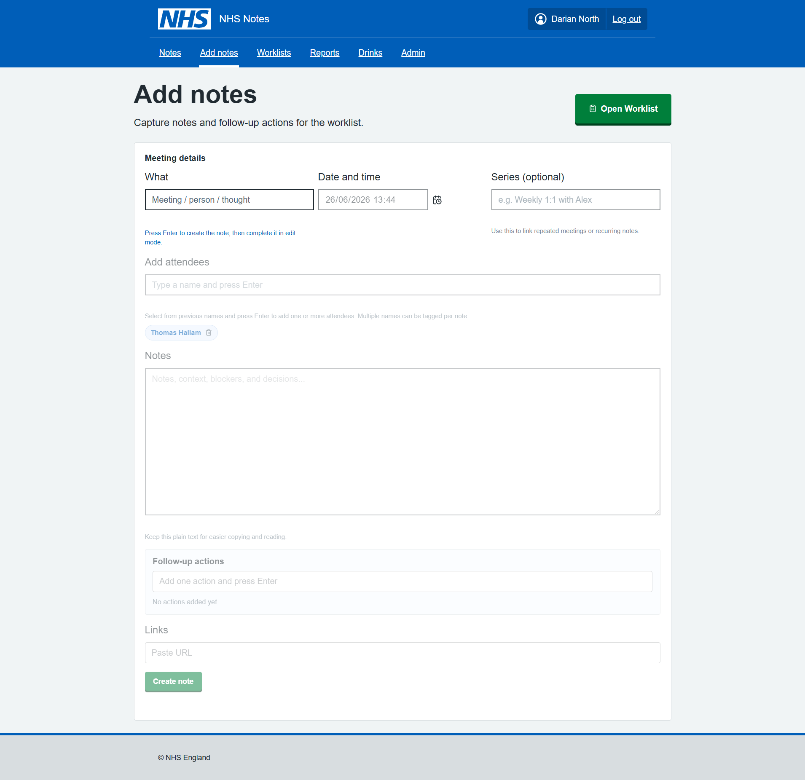
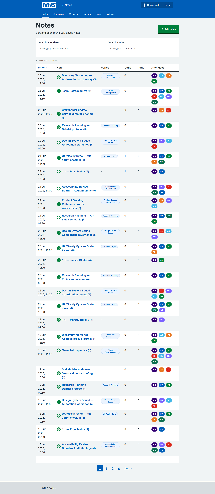
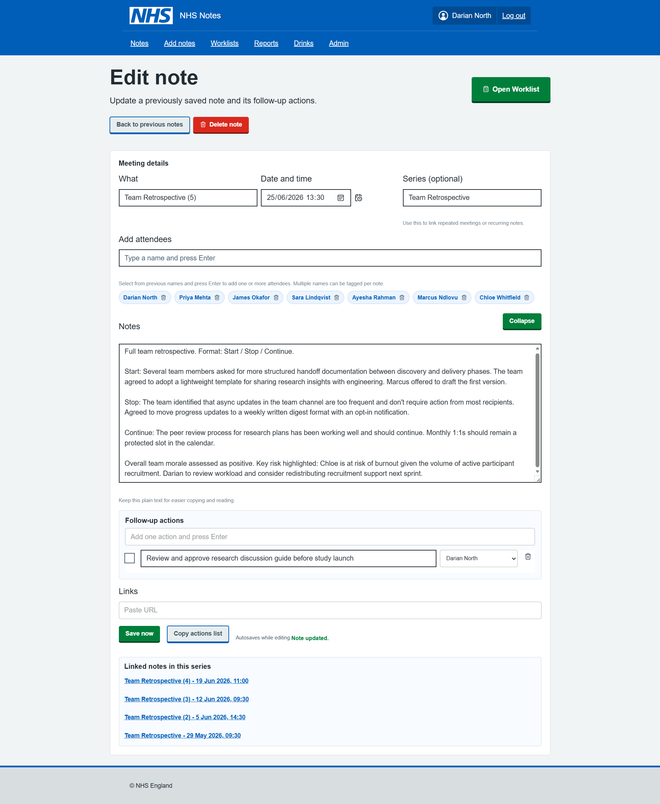
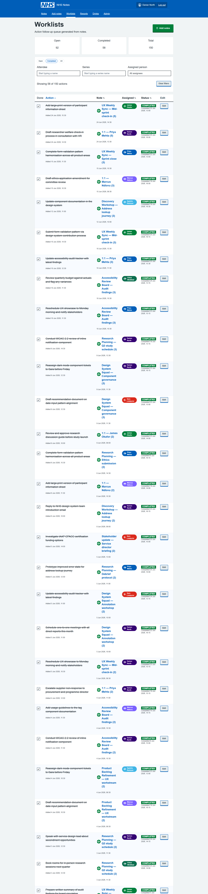
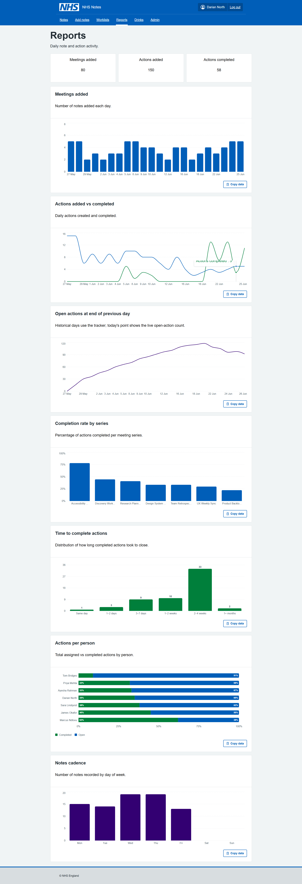
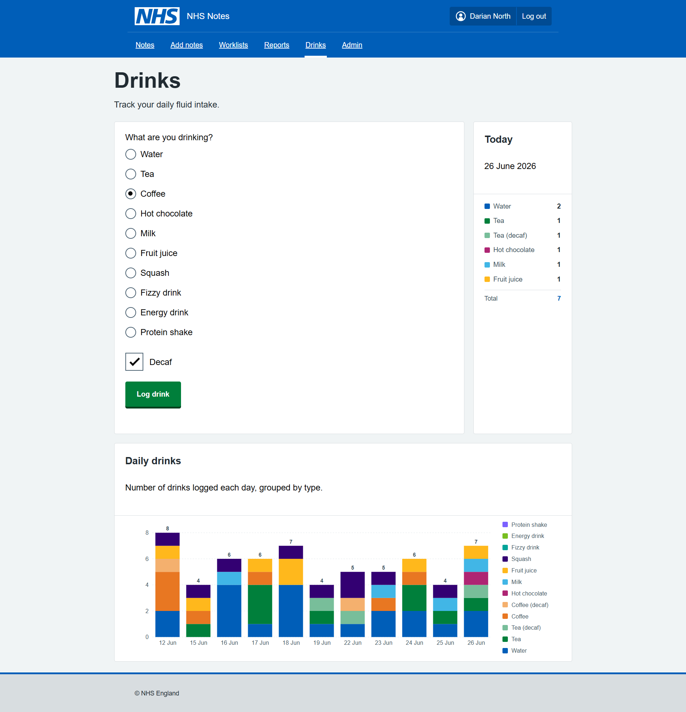
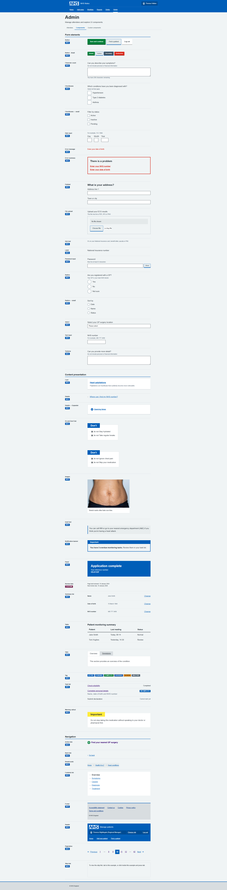
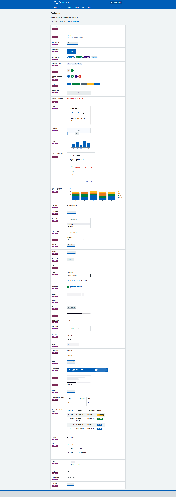
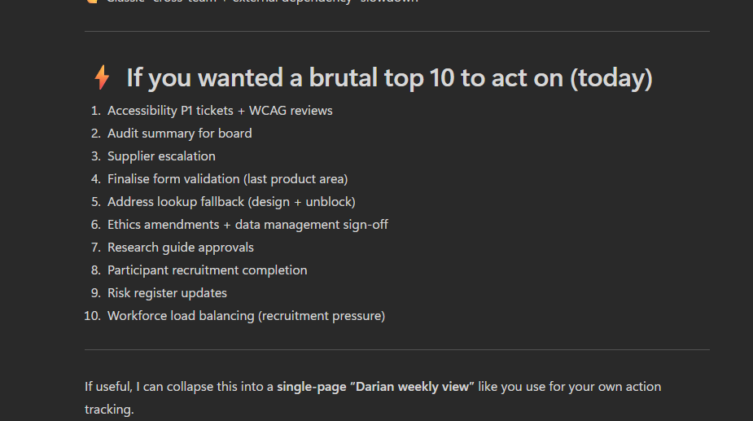

The main "problem" of the month, was not the changes happening around us, but the general overwhelm / risk of burnout. Too many requests, too few people. Scope expansions, uncertainties...

I've tried many times in the past to solve this problem, to stop the tide of busy-ness. I say no to more requests. But the problem always repeats itself. Now I'm trying to find my own solution.

Nay-sayers will say, the experiment is pointless, also. The topic of personal note taking and task prioritisation has been solved millions of times before... it could be solved with Text File, Word Files, MS ToDo, Planner or OneNote, Jira, Trello, or many other ways... 

For me, however, none of those tools provide a sensible structure, or insights to help me understand where things are at. It also provides some level of escapism from the ridiculousness of the ongoing merger situation at NHSE (i'm sure most would agree). And, moving away from out of the box tools provides an opportunity to experiment and grow, I wanted to learn:

* What it's really like to create a working tool using the NHS Front End Design System, assisted with AI.
* What it's like to use your own teams product

Here's how I got on.

 

## Dogfooding 

When you use your own product, every day, in anger. You quickly realise where the problems are. 

 

### Adding notes

Building on the [previous post](../2026-06-02/prompts-to-prototypes.html) I used Claude CLI to completely rebuild the Cardiac App into something more practical.

I started with an add notes feature, this was initially just a basic form with limited options. 

There was lots of errors initially, such as the form not saving the data, pages reloading and losing data, duplicated entries. 

{.external fig-alt="Add notes form created in Claude CLI" fig-align=left width=800px}

 

### Notes list

After adding the notes, I realised I wanted to be able to view my notes. Starting with a very basic table (react component) I then migrated to the NHS Table component.

It was quite evident the table was far too rigid for the idea I had... 

Some of the features I found difficult with the standard NHS table included:

* overly large fonts,
* padding and margins,
* row highlights,
* not sortable,
* no sort direction,
* alignment,
* link underlines - they are really annoying in a big table when every text link is underlined, felt easier to use by adding link icons and override font colours,
* heading sizes and styling, 
* limited examples of buttons within tables, 
* visually unappealing.

I asking Claude to work through all the layout issues was new ideas, it's not perfect by any means, but in the table, the table was working as hoped.

Adding the Series filter and the Attendees filter, both clickable in the table, really enhanced the experience. 

Changes are shown immediately no page reloads which makes it really usable. I imagine this might be an issue for accessibility, but the accessibility audit did say that labels are adding correctly to all components.

{.external fig-alt="Notes table, created with Claude CLI" fig-align=left width=800px}

 

### Edit note page

After a week or two of using this, and made some little tweaks to various pages components, improving the styling and form validation, I think it works now (just about). 

I started with being able to add one link to a Jira ticket, then quickly realised this wasn't enough and expanded it to 12 links. So if I complete a desk review, I can save all the links in the note.

For public websites, I can use these directly in Claude for data mining (more on that later).

{.external fig-alt="Edit note page with example data" fig-align=left width=800px}

 

### Worklists page

After a few days of adding notes, I wanted to have somewhere to see all the actions. Again initially a basic list, but the styling and functions were added slowly.

Interesting Claude implement Search fields for two options and a drop down on the third. Unclear why, but I like it!

It was really annoying trying to get Claude to line up custom and NHS components, as the padding and margins are vastly differnet and Claude cannot see what is going on. In a few cases it was necessary to override NHS or custom styles with +- px. Which is never a good sign... those little misalignments are really frustrating when you use a tool all day. The combined components approach definitely made it more difficult to get the end thing looking acceptable.

Other issues on this page included the Card Components by default spacing, alignment and font sizing needing to be updated to look 'sensible'.

The filter buttons were custom components, as well the user avatars, and the search fields.

{.external fig-alt="Worklists page with Cards to show key stats and actions table. The completed actions are ticked and crossed out. There are search fields." fig-align=left width=800px}

The page was also excessively long, and Claude does not know that, nor does it add pagination on tables by default. But when asked, Pagination could be implemented very quickly with the correct NHS Component.

 

### Reports page 

The reports page was really the reason this whole app was created, being able to visual the number of meetings, notes, actions being added and completed daily. It gives great insight, and with the data stored in .json locally, there would be many other interesting bits of analysis that could be conducted.

The components are from open source react libraries, they would need to be reviewed for accessibility and styling could be better, but overall really easy to implement in Claude CLI without writing any code.

{.external fig-alt="Copilot generated 3d renders for multiple watch pages" fig-align=left width=800px}

 

### Drinks page - just for fun

This page was just added as an experiment, could Claude CLI create a new feature, from scratch, with just the Copilot Guidance and NHS Front-end system? 

Claude did implement it first time working perfectly, but there was some custom components which could have been NHS components. 

The lesson was the LLM needs better hand-holding to prioritise those components, and when it does need to make component change, it should document what it did, rather than jumping straight to custom fixes. 

{.external fig-alt="Just for fun - track your drinks during the day, stay hydrated!" fig-align=left width=800px}

Arguably with the recent 30 degrees heat daily, this was the MOST IMPORTANT FEATURE.

 

### Components in React

I was unsure if the NHS React Components were loading correctly and also the correct version... 

I then asked Claude CLI to implement an admin page to show how each component and label where they came from:

{.external fig-alt="Admin page showing list of all the NHS Components working" fig-align=left width=800px}

{.external fig-alt="Admin page with Custom Components" fig-align=left width=800px}

I asked Claude to check the components were the latest versions. There was indeed a few discrepencies between the nhs-react-front-end  and the Front End V10. I asked Claude CLI to check all the components are up to date and get the latest components it did a pretty good job. 

 

### Data mining

As well as the reports, I create an MS Copilot prompt to summarise my notes and priorities with a scheduled daily report. It was excellent for looking first thing each day to decide what to focus on.
{.external fig-alt="Darian's priorities reviewed by Copilot" fig-align=left width=800px}

 

### Learnings along the way

Using our own design system every day for a week was quite revealing. 

Using NHS Components "as-is", all day, made for a very frustrating experience... too much space, scrolling, huge buttons, buttons misalinged and overflowing boxes everywhere,  layout issues. 

Using Claude CLI and VsCODE was a really great experience. Building a whole app via Claude CLI only, trying different models (Haiku 4.5 / Sonnet 4.6, 4.7/ OpenAI-5.3-codex), really helped me learn differences in performance and nuances in the behaviour of the models. 

Github Copilot / Claude CLI seem to reguarly add little icons and buttons to help the usability. While these might be considered non-standard, they really help with the mouse navigation when you are racing around a screen that you might use for an hour non-stop. Your brain gets used to where they are and targets them more quickly. e.g. NHS buttons don't typically have an arrow or icon inside them, but I kind of like it.

I learn about how to improve the Copilot Instructions to ground the models in the behaviours that would ensure better aligned to NHS Standards. There were still lots of areas that Claude/Copilot can improve on.

Claude helped me with the Accessibility Review, it helped identify and solve Security issues, it helped with complex refactors and package updates.

React is an excellent tool for building services, it has great modular/ extensions. 

 

## TL;DR 

The NHS Front End (and Prototype Kit) and React port need more work support design of systems for "professionals".

Also using LLMs to deploy NHS Components is tricky, they need better quality guidance around Custom NHS Components documenting the UI decisions/changes.

There were a few custom NHS components we (Claude+1) ended up creating... if anyone is interested testing the app, or collaborating on this project - happy to share this work!

Hope you enjoyed this!!

 

 

---

 

## Claude's own review of building the React NHS Notes App

### Building an NHS Meeting Notes Tool: A Developer's Honest Account

What Is It?

This is a personal productivity tool built specifically for NHS work — a note-taking app for meetings that actually does something useful with what you write down.

At its core, the app lets you:

- Write meeting notes with a date, title, and freeform text area
- Log action items per meeting, assign them to attendees, and track completion
- Group meetings into series (recurring meetings like weekly standups or MDTs) so you can filter and review across a whole run of them
- Manage attendees — build up a reusable people list so you can quickly tag who was in the room
- Add links — up to 12 per note, for things like Jira tickets, SharePoint documents, or any relevant URL
- Browse your notes archive — a sortable, filterable table showing every saved meeting, with action completion counts at a glance
- Manage a cross-meeting worklist — a flat view of every action across all notes, filterable by who it's assigned to, with the ability to edit actions inline and tick them off without going back into the original note
- View reports — Recharts-powered dashboards showing meeting activity over time, action completion rates by series, actions per person, and meeting cadence breakdowns
- Log drinks — a side feature for tracking personal hydration, with its own charts and NHS-styled UI
- Inspect design system components — an admin area containing a live showcase of both NHS Design System components and custom ones, useful for rapid UI reference

All data lives in JSON files on your local machine (or wherever you point the NOTES_DIR environment variable — useful if you want it synced via OneDrive).

The earliest commit is figma make react app local version — the app originated from a Figma Make export. That's a clue: this wasn't designed from scratch in a code editor, it was visually composed and then landed in the repository as a working React/Vite app. The initial scaffolding was already there; the real work was shaping it into something fit for daily NHS use.

Within the same session, a locally working prototype commit followed, then immediately a Configure Heroku deployment with serve package — so there was an early attempt to put this somewhere hosted. That idea appears to have been quietly shelved; the project eventually pivoted to running entirely locally, which makes much more sense given that the data is personal clinical notes.

------------------------------------------------------------------------------------------------------------------------------------------------------------------------------------------------------------

### The Notes Feature: Built in a Crunch

The notes work arrived in a cluster of commits on 4 June 2026: add notes and notes worklist, add previous notes page and tick off notes, add notes edit tick, add attendees, and add autosave fix worklist add reports — all in a single day. That's the kind of commit history that says "I had a clear vision and just needed to build it fast."

Autosave was added almost immediately — likely because losing a note mid-meeting is exactly the kind of thing that would make a tool like this useless in practice. The implementation uses a signature-based dirty check: it serialises the form state to a JSON string, compares it against the last-saved signature, and only writes if something actually changed. It also carries a loadedNoteIdRef to prevent a race condition where loading an existing note could inadvertently trigger a duplicate save on mount — a bug that did eventually slip through and needed a dedicated fix (Fix autosave duplicate note bug on Add notes page, June 2026).

------------------------------------------------------------------------------------------------------------------------------------------------------------------------------------------------------------

### The Styling Wars

The commit history between 8–15 June reads like a genuine struggle with CSS:

- fix styling to nhs pages
- fix previous notes table
- get back on style system
- fix nhs styling on header footer and buttons
- fix header to nhs styling, wider drinks page
- fix styling of Previous notes worklist
- fix warning popup and styling

The NHS Design System is specific. There's an official component library (nhsuk-react-components), official colour tokens, official typography rules. The challenge is that this app is built on Tailwind CSS with shadcn/Radix UI primitives — a completely different paradigm. Mixing the two systems without them stepping on each other is genuinely fiddly.

The solution the codebase settled on: inline styles for NHS-specific colours and layout, Tailwind for responsive utilities. It's pragmatic rather than elegant — the inline styles ensure pixel-accurate NHS compliance while Tailwind handles things like hidden md:flex breakpoints. There's even a note in the Copilot instructions acknowledging this is intentional, not a mistake.

The admin section at /notes/admin/components exists partly as a sanity check — a live reference page showing NHS Design System components rendered correctly, alongside a custom components page. If something looks wrong, you can compare it directly against the reference.

------------------------------------------------------------------------------------------------------------------------------------------------------------------------------------------------------------

### Accessibility: Caught Late, Fixed Properly

Two commits on 8 June: fix accessibility errors and accessibility fixes, followed later by a security review on 18 June.

The accessibility fixes cover real issues — aria-sort on sortable table headers, aria-live="polite" on the results count so screen readers announce filter changes, aria-label and aria-pressed on the attendee avatar buttons, visually hidden labels with .sr-only, and proper scope="col" on table headers. These aren't superficial changes; they suggest the app was reviewed against actual WCAG criteria, not just eyeballed.

------------------------------------------------------------------------------------------------------------------------------------------------------------------------------------------------------------

### Growing the Feature Set

Series linking (9 June) — the ability to tag notes as belonging to a recurring meeting series — turned out to be more impactful than it sounds. Once you have it, the filter-by-series chip on the notes table lets you instantly pull up every MDT from the last three months. The series tag is clickable in the table to instantly filter, which is a nice small touch.

Jira links went through a few iterations. The original model was a single jiraTicketLink field per note; that field still exists in the data schema as a legacy field. It was superseded by a links[] array, capped initially at some lower number, then raised to 12 (allow up to 12 links per note, June 2026). The cap exists to keep the UI manageable rather than for any technical reason.

Reports grew incrementally — add autosave fix worklist add reports introduced the first charts, then add more reports extended them. The final reports page covers: daily meeting and action activity (line chart), open actions over time, completion rate by meeting series, a completion-time histogram, actions per person, and meeting cadence by day of week. Each chart has a "copy as TSV" button so you can paste directly into Excel.

Drinks (add drinks feature with nhs style system, 12 June) is the unexpected one. It's a hydration tracker — log a drink (water, tea, coffee, and a surprisingly long list of other options), mark whether it's decaf, and see a bar chart of daily intake. It's built in the same NHS style as everything else and runs against its own /api/drinks endpoint. Whether it was a quick experiment or a genuine daily-use feature, it's fully functional and properly styled.

------------------------------------------------------------------------------------------------------------------------------------------------------------------------------------------------------------

### The Data Model

The data architecture is straightforward but thoughtfully layered:

- notes.json — array of ConsultantActionNote objects, each containing meeting metadata, freeform notes text, an array of ConsultantActionItem objects, and an array of attendee IDs
- notes-people.json — the people registry, giving each attendee a stable ID, name, and optional colour
- notes-tracker.json — a daily snapshot of open action count, used to plot the "open actions over time" chart accurately even on days when no changes were made
- drinks.json — separate drinks log

The storage path is configurable at three levels: NOTES_FILE_PATH environment variable, NOTES_DIR environment variable (pointing to a folder), or a legacy notes.config.json. This makes it easy to point the data at a OneDrive folder without changing any code — important if you want your notes backed up and accessible from multiple machines.

------------------------------------------------------------------------------------------------------------------------------------------------------------------------------------------------------------

### What It's Built On

- React + TypeScript + Vite — standard modern stack
- Tailwind CSS — utility classes for layout and responsive behaviour
- shadcn/Radix UI — accessible component primitives (Dialog, AlertDialog, Table, etc.)
- nhsuk-react-components — official NHS Design System React components
- Recharts — the reporting charts
- React Router — client-side routing
- A custom Node.js HTTP server — no Express, no framework; just node:http handling the API routes and serving the built Vite output

The Vite config also has two custom plugins: one that strips @x.y.z version specifiers from imports (for Figma Make compatibility, a remnant of the origin story), and one that resolves figma:asset/ import paths to the local assets folder.

------------------------------------------------------------------------------------------------------------------------------------------------------------------------------------------------------------

### The Honest Summary

This is a tool built to solve a real problem: taking structured meeting notes in an NHS context, tracking the actions that come out of them, and not losing that information to a sprawling email thread or a forgotten notebook. It's not a product, it's personal infrastructure — built quickly, iterated on rapidly, and designed to fit one specific workflow.

The NHS styling isn't decorative. Working in an NHS environment means the tool needs to feel familiar and trustworthy alongside the other systems people use every day. Getting that right took more commits than expected, but the result is a UI that would pass as an internal NHS tool rather than something knocked up at home.

The code is clean, the data stays local, and the accessibility is taken seriously. For a prototype that started from a Figma export, it's come a long way.

